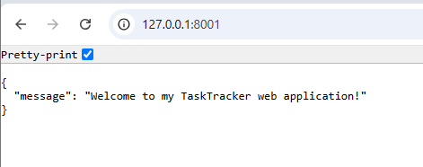
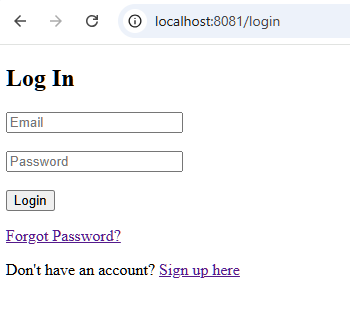
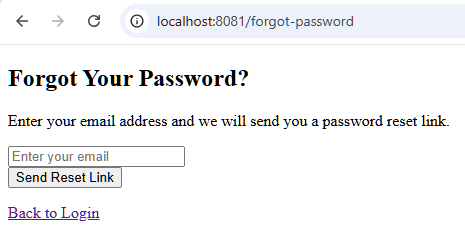
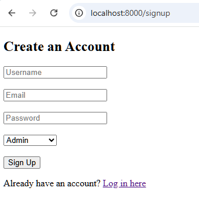
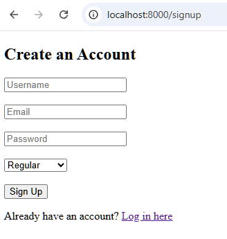
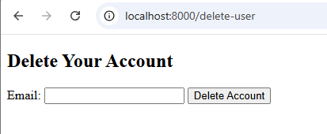
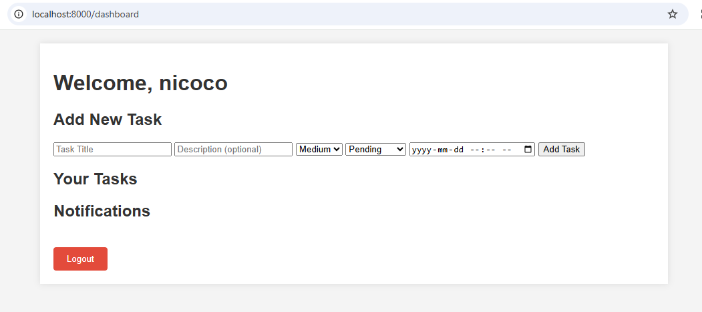
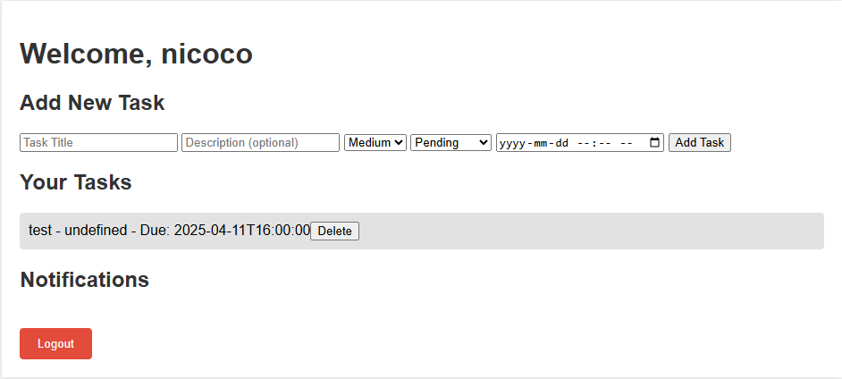

# 🧠 Task Tracker – Full-Stack Task Management App

**Built with FastAPI, PostgreSQL, Docker, and Google Calendar Integration**  
COMP 351 – Advanced Website Programming | UFV | Jan–Apr 2025

---

## 📌 Project Overview

Task Tracker is a full-featured task management application I developed as part of UFV's COMP 351 course. It allows users to register, log in, and manage personal tasks in a secure and scalable environment. I implemented JWT-based authentication, role-based access control, Google Calendar integration, and deployed the app in a Dockerized environment.

This project was my opportunity to build a backend system with integrated third-party services and full API coverage.

---

## 🚀 Key Features

### ✅ User Authentication & Roles
- JWT-secured login and signup
- Passwords hashed using Bcrypt
- Admin vs Regular user access (role-based control)

### 📋 Task Management
- Create, update, delete personal tasks
- Assign priority levels and due dates
- Filter by status and title
- Pagination for large datasets

### 🔄 Google Calendar Integration
- Sync task deadlines to user’s Google Calendar
- Receive task reminders across devices
- Manage schedules more efficiently

### 📦 Dockerized Deployment
- Docker + Docker Compose for full-stack deployment
- `.env` used for secure DB & secret key configs
- PostgreSQL + Alembic for database migration

---

## 🔧 Tech Stack

- **Backend:** FastAPI, Python
- **Database:** PostgreSQL, SQLAlchemy, Alembic
- **Auth:** JWT, OAuth2, Bcrypt
- **Deployment:** Docker, Docker Compose
- **Integration:** Google Calendar API
- **Documentation:** OpenAPI (via FastAPI)

---

## ⚙️ Setup Instructions (Local)

Note: This setup section outlines how I structured and ran the environment during development.

1. Clone the repository  
2. Create and activate a virtual environment:
    ```bash
    python -m venv venv
    source venv/bin/activate
    ```
3. Install dependencies:
    ```bash
    pip install -r requirements.txt
    ```
4. Configure `.env` with your secrets and DB URL
5. Apply DB migrations with Alembic
6. Run the app:
    ```bash
    uvicorn main:app --reload
    ```

---

## 🧪 Sample API Endpoints

| Method | Endpoint             | Description                     |
|--------|----------------------|---------------------------------|
| POST   | `/api/auth/signup`   | Register a new user             |
| POST   | `/api/auth/login`    | Log in and get a token          |
| GET    | `/api/tasks`         | Fetch tasks (requires token)    |
| POST   | `/api/tasks`         | Create a task                   |
| PUT    | `/api/tasks/{id}`    | Update a task                   |
| DELETE | `/api/tasks/{id}`    | Delete a task                   |

---

## Screenshots of key interfaces & improvements

### Home Page:

<br>


### Log-In Page:

 <br>

### Reset Password Page:

 <br>

### Sign-Up Page:

 <br>
 <br>

### Deleting account if the user can't log in:

 <br>

### Dashboard Page:

### This is the dashboard after logging in:
 <br>

### This is the dashboard after adding task:
 <br>

## 📌 Reflection

This was one of my most rewarding projects. I gained experience in backend authentication, role-based security, API integration, and full-stack deployment. Integrating Google Calendar added a real-world look that made the app more practical and user-friendly.

---

## 📚 References

- [FastAPI Docs](https://fastapi.tiangolo.com)
- [FastAPI Security (OAuth2 + JWT)](https://fastapi.tiangolo.com/tutorial/security/)
- [Deploying with Docker](https://fastapi.tiangolo.com/deployment/docker/)
- [SQL Databases with FastAPI](https://fastapi.tiangolo.com/tutorial/sql-databases/)

---

> 🔒 **Disclaimer:** This project was originally developed for COMP 351 at the University of the Fraser Valley. No original source code from the course is included in this repository. README content is written independently for portfolio and demonstration purposes only.